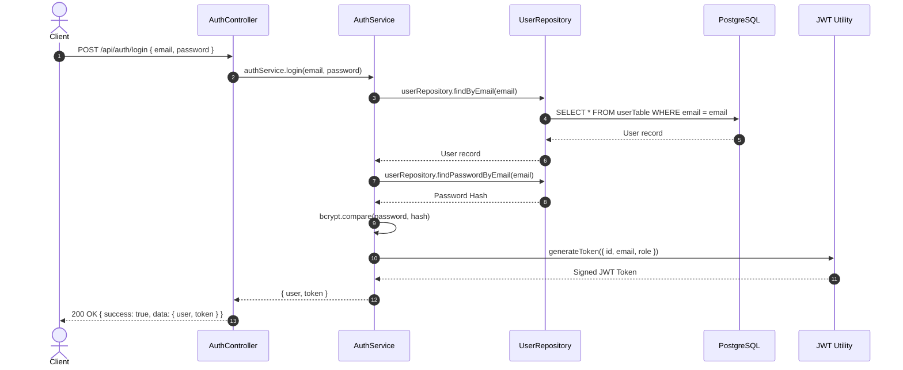
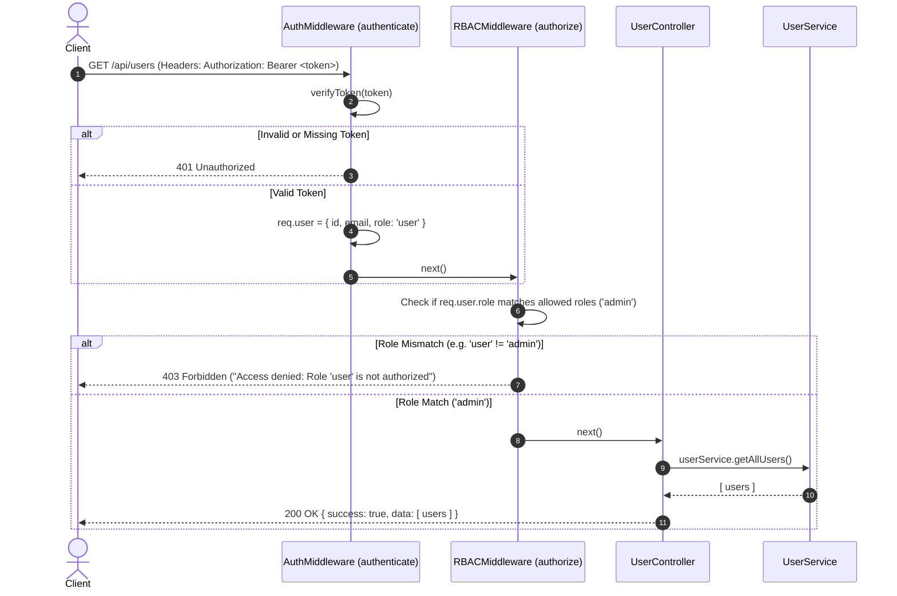

# CDN Backend Architecture & Design

This document details the architectural design, folder structure conventions, JWT authentication flow, and Role-Based Access Control (RBAC) implementation for the CDN Backend API.

---

## 1. Layered Folder Structure

The project follows a clean, layered architectural pattern where each layer has a distinct single responsibility:

```
CDN/
├── src/
│   ├── config/              # Configuration and environment loaders
│   │   ├── database.js      # Drizzle ORM + Postgres client connection
│   │   ├── env.js           # Centralized environment variable validation
│   │   └── redis.js         # Redis client with retry strategies
│   │
│   ├── db/                  # Database schema definitions and migrations
│   │   └── schema.js        # Drizzle ORM table schemas (users, roles, timestamps)
│   │
│   ├── error/               # Domain-specific custom error classes
│   │   ├── ForbiddenError.js          # 403 Forbidden (RBAC permission denied)
│   │   ├── InvalidCredentials.js      # 401 Invalid Credentials & 409 User Already Exists
│   │   ├── InvalidPassword.js         # 401 Invalid Password
│   │   ├── NotFoundError.js           # 404 Not Found
│   │   └── UnauthorizedError.js       # 401 Unauthorized (Missing/invalid JWT)
│   │
│   ├── middleware/          # Express HTTP middleware
│   │   ├── auth.middleware.js         # Extracts and verifies JWT Bearer token
│   │   └── rbac.middleware.js         # Role-Based Access Control authorization
│   │
│   ├── repository/          # Data Access Layer (raw DB queries via Drizzle ORM)
│   │   ├── user.repository.js         # User CRUD and role queries
│   │   └── user.repositry.js          # Backward compatibility re-export
│   │
│   ├── service/             # Business Logic Layer
│   │   ├── auth.service.js            # Registration, bcrypt hashing, login, JWT issuance
│   │   └── user.service.js            # User retrieval and admin role management
│   │
│   ├── controllers/         # HTTP Request / Response Handlers
│   │   ├── auth.controller.js         # Handles auth endpoints (/register, /login, /me)
│   │   └── user.controller.js         # Handles user & admin endpoints (/users, /admin/dashboard)
│   │
│   ├── route/               # Express Route Definitions
│   │   ├── auth.route.js              # /api/auth routes
│   │   ├── health.route.js            # /api/health routes
│   │   └── user.route.js              # /api/users routes (RBAC protected)
│   │
│   ├── utils/               # Shared utilities & helpers
│   │   ├── jwt.js                     # JWT signing & verification helpers
│   │   └── swagger.js                 # Swagger OpenAPI 3.0 configuration
│   │
│   └── index.js             # Express application entry point & middleware pipeline
│
├── .env.example             # Example environment variables
├── docker-compose.yml       # PostgreSQL 16 & Redis 7 container orchestration
├── drizzle.config.js        # Drizzle Kit CLI configuration
└── package.json             # Project dependencies and npm scripts
```

---

## 2. JWT Authentication Flow

JSON Web Tokens (JWT) are used for stateless, secure user authentication:



---

## 3. Role-Based Access Control (RBAC) Flow

RBAC restricts access to endpoints based on the `role` stored inside the JWT token:



---

## 4. Roles & Permissions Matrix

| Endpoint | Method | Required Auth | Allowed Roles | Description |
| :--- | :--- | :--- | :--- | :--- |
| `/api/auth/register` | `POST` | Public | None | Register new user account |
| `/api/auth/login` | `POST` | Public | None | Login and receive JWT token |
| `/api/auth/me` | `GET` | Bearer Token | `user`, `admin`, `moderator` | View current user profile |
| `/api/users` | `GET` | Bearer Token | `admin` | List all users in system |
| `/api/users/:id` | `GET` | Bearer Token | `user`, `admin`, `moderator` | View user by ID |
| `/api/users/:id/role` | `PATCH` | Bearer Token | `admin` | Promote/demote user role |
| `/api/users/admin/dashboard` | `GET` | Bearer Token | `admin` | Admin dashboard metrics |
| `/api/health` | `GET` | Public | None | DB & Redis health check |
